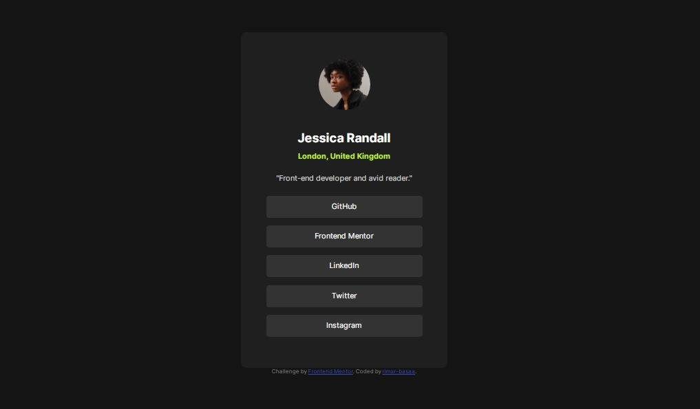

# Frontend Mentor - Social links profile solution

Esta es la solucion para [Social links profile challenge on Frontend Mentor](https://www.frontendmentor.io/challenges/social-links-profile-UG32l9m6dQ).

## Tabla de contenido

- [Overview](#overview)
- [Captura pantalla](#captura-pantalla)
- [Enlaces](#enlaces)
- [Mi proceso](#mi-proceso)
- [Construido con](#construido-con)
- [Autor](#autor)

## Overview

### The challenge

Users should be able to:

- See hover and focus states for all interactive elements on the page

### Captura pantalla

### Enlaces

- Solucion URL: [Add solution URL here](https://github.com/rimar-basaa/frontmentor-social-profile)
- Live Site URL: [Add live site URL here](https://frontmentor-social-profile.vercel.app/)

## Mi proceso

### Construido con

- HTML5 marcado semantico
- CSS para estilos
- Flexbox para posicionamiento

## Autor

- Frontend Mentor - [@rimar-basaa](https://www.frontendmentor.io/profile/rimar-basaa)

